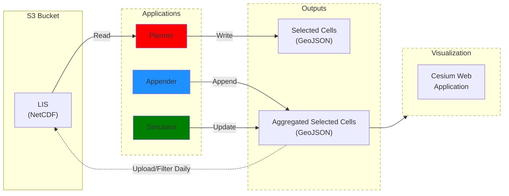

# SOS <!-- omit from toc -->

This repository contains the codebase for Snow Observing Strategy (SOS) applications integrated within the [Novel Observing Strategies Testbed (NOS-T)](https://github.com/code-lab-org/nost-tools).

- [Installation](#installation)
  - [NOS-T Tools Installation](#nos-t-tools-installation)
  - [AWS CLI Installation](#aws-cli-installation)
- [Introduction](#introduction)
  - [Applications Overview](#applications-overview)
  - [Messaging Protocol](#messaging-protocol)
  - [Data Structure \& Interfaces](#data-structure--interfaces)
- [Execution](#execution)
  - [YAML](#yaml)
  - [.env](#env)
  - [Conda](#conda)
  - [Docker](#docker)
- [Cesium Visualization](#cesium-visualization)
  - [Event Broker on Local Host](#event-broker-on-local-host)
  - [Cesium Access Token](#cesium-access-token)
  - [Env.js File](#envjs-file)
  - [HTTP Server](#http-server)


## Installation

### NOS-T Tools Installation

To install the NOS-T library, follow the directions [here](https://nost-tools-v2.readthedocs.io/en/latest/installation/installation.html).

### AWS CLI Installation

To setup the Amazon Web Services (AWS) command line interface (CLI), follow the directions [here](https://nost-tools-v2.readthedocs.io/en/latest/operators_guide/modules/aws.html).

## Introduction

A single manager application is responsible for orchestrating the various applications and keeping a consistent time across applications. Upon initiation of the manager, various managed applications are triggered, each responsible for generating derived, merged datasets or raster layers sent as base64-encoded strings. Below is a table describing each application:

|Application|Purpose|Data Source|Developed|Containerized|
|:---------:|:-----:|:---------:|:-------:|:-----------:|
|**Manager**|Orchestrates applications, maintains time|NA|Y|Y|
|**Planner**|Selects best taskable observations on the basis of reward|LIS|Y|N|
|**Appender**|Aggregates planned taskable observations, filtering duplicates|Planner|Y|N|
|**Simulator**|Simulates satellite operations and determines when and where observations are collected|Appender|Y|N|

### Applications Overview

Applications communicate via a RabbitMQ message broker utilizing the Advanced Message Queuing Protocol (AMQP) protocol. The figure below illustrates the overall workflow:

<!-- <p align="center">
  
  <br>
  <em>Snow Observing Systems (SOS) application workflow.</em>
</p> -->


### Messaging Protocol

The SOS applications utilize the [Advanced Message Queuing Protocol (AMQP)](https://www.amqp.org/) through a [RabbitMQ event broker](http://rabbitmq.com/). These messages include:

| Application | Receives | Sends |
|:-----------:|:--------:|:-----:|
| **Planner** | Data availability messages from AWS Lambda function | Selected cells are saved as GeoJSON file and the contents of this file are also sent as an AMQP message to the appender application |
| **Appender** | Message from planner containing the selected cells | Aggregates the selected cells into a record, filters duplicate rows, and sends an AMQP message to the simulator application |
| **Simulator** | Message from the appender containing the aggregated selected cells record | Simulate satellite operations and determines when and where observations are collected, sends to Cesium web application |

### Data Structure & Interfaces

The input data and output data generated by applications are uploaded onto an Amazon Web Services (AWS) Simple Storage Service (S3) bucket.

> **Note:** The applications use the AWS SDK for Python, [Boto3](https://boto3.amazonaws.com/v1/documentation/api/latest/index.html). Boto3 allows users to create, configure, and manage AWS services, including S3, Simple Notification Service (SNS), and Elastic Compute Cloud (EC2). Access to the AWS SDK is limited to SOS administrators as required by NASA's [Science Managed Cloud Environment (SMCE)](https://smce.nasa.gov/). 

<p align="center">
  
  <br>
  <em>Amazon Web Services (AWS) resources used by the SOS applications within the NOS-T system include S3 and Lambda.</em>
</p>

The LIS inputs are stored in an S3 bucket, which the SOS applications access. The SOS applications then output data into an output directory, organized by the specific day and application. Below is an example:

```bash
snow_observing_systems/
├── input
│   ├── 2019-03-01
│   │   └── LIS
│   ├── 2019-03-02
│   │   └── LIS
│   └── 2019-03-03
│       └── LIS
└── output
    ├── 2019-03-01
    │   ├── Appender
    │   ├── Planner
    │   └── Simulator
    ├── 2019-03-02
    │   ├── Appender
    │   ├── Planner
    │   └── Simulator
    └── 2019-03-03
        ├── Appender
        ├── Planner
        └── Simulator
```

<p align="center">
  
  <br>
  <em>Flow of data between the various applications.</em>
</p>

## Execution

The SOS applications can be executed using Conda or Docker. The steps for executing Conda are provided below, assuming you have following the [NOS-T installation instructions](https://nost-tools-v2.readthedocs.io/en/latest/installation/installation.html) and [AWS CLI installation instructions](https://nost-tools-v2.readthedocs.io/en/latest/operators_guide/modules/aws.html).

### YAML

In the `sos` directory, create a YAML file named `sos.yaml` with the following contents:

```yaml
info:
  title: Novel Observing Strategies Testbed (NOS-T) YAML Configuration
  version: '1.0.0'
  description: Version-controlled AsyncAPI document for RabbitMQ event broker
servers:
  rabbitmq:
    keycloak_authentication: False
    host: "localhost"
    port: 5672
    tls: False
    virtual_host: "/"
    message_expiration: "60000" # in milliseconds, message expiration time
    delivery_mode: 2 # 1=transient, 2=durable
    content_type: "text/plain"
    heartbeat: 30 # in seconds
    connection_attempts: 3
    retry_delay: 5 # in seconds
  keycloak:
    host: "nost.smce.nasa.gov"
    port: 8443
    tls: True
    token_refresh_interval: 10 #in seconds
    realm: "NOS-T"
execution:
  general:
    prefix: sos
  manager:
    sim_start_time: "2019-03-01T23:59:59+00:00"
    sim_stop_time: "2019-03-10T23:59:59+00:00"
    start_time:
    time_step: "0:00:01"
    time_scale_factor: 144 # 1 simulation day = 5 wallclock minutes
    time_scale_updates: []
    time_status_step: "0:00:01" # 1 second * time scale factor
    time_status_init: "2019-03-01T23:59:59+00:00"
    command_lead: "0:00:05"
    required_apps:
      - manager
      - planner
      - appender
      - simulator
    init_retry_delay_s: 5
    init_max_retry: 5
    set_offset: True
    shut_down_when_terminated: False
  managed_application:
    time_scale_factor: 144 # 1 simulation day = 5 wallclock minutes
    time_step: "0:00:01" # 1 second * time scale factor
    set_offset: True
    time_status_step: "0:00:10" # 10 seconds * time scale factor
    time_status_init: "2019-03-01T00:00:00+00:00"
    shut_down_when_terminated: False
    manager_app_name: "manager"
```

### .env

In the `sos` directory, create a `.env` file with the following content specific to your event broker running on local host:

```sh
USERNAME="admin"
PASSWORD="admin"
CLIENT_ID=""
CLIENT_SECRET_KEY=""
```

### Conda

Activate the Conda environment:

```bash
conda activate nost
```

Run each application in a separate terminal, making sure to start the manager application first:

- Terminal 1:

```bash
python3 src/manager/main.py
```

- Terminal 2:

```bash
python3 src/planner/main.py
```

- Terminal 3:

```bash
python3 src/appender/main.py
```

- Terminal 4:
```bash
python3 src/simulator/main.py
```

Below is an example:

<p align="center">
  
  <br>
  <em>Terminal running all four SOS applications.</em>
</p>

### Docker

> **Note:** This section is coming soon.

## Cesium Visualization

Setting up a Cesium visualization requires you (*i*) set up an event broker on local host, (*ii*) acquire a Cesium access token, (*iii*) create an env.js file with credentials, and (*iv*) run an HTTP server to expose local files. Each of these steps are covered below.

### Event Broker on Local Host

To setup an event broker on local host, follow the directions [here](https://nost-tools-v2.readthedocs.io/en/latest/operators_guide/modules/localBroker.html).

### Cesium Access Token

1. Sign in or create an account at: https://cesium.com/ion/signin/tokens.

2. Create a new access token by clicking the blue "Create token" button located in the upper left corner.

3. Add the Asset "Blue Marble Next Generation July 2004" to your assets: https://ion.cesium.com/assetdepot/3845?query=Blue%20Mar. Click the blue 'Add to my assets' button located in the bottom right corner.

### Env.js File

1. In the `sos/src/visualization` directory, create a file named `env.js` file with the following contents:

    ```javascript
    var HOST="localhost"
    var RABBITMQ_PORT=15670
    var USERNAME=  #Your RabbitMQ username
    var PASSWORD=  #Your RabbitMQ password
    var TOKEN=     #Cesium access token
    ```

    > **Note:** Add your Cesium access token that you generated in the [Cesium Access Token Section](#cesium-access-token).

### HTTP Server

1. In the `sos/src/visualization` directory, run an HTTP server:

    ```bash
    python3 -m http.server 7000
    ```

3. In your web browser, navigate to http://localhost:7000

4. Finally, click on `cesium_visualization.html`. You should see a Cesium visualization web application running on local host.

<!-- ### Docker (Development)

Each container can be built individually during development, to build a local version of a container, you can use ```docker build```. 

For example, to build the "manager" comntainer:

```
cd src/manager/
docker build -t sos_manager .
docker run --rm --env-file .env -v "$(pwd)/data":/opt/data sos_manager
```

> NOTE: You can follow similar steps to build the other containers, such as satellites, layer_resolution, layer_snow_cover, etc.

### Docker Compose
Three applications, including manager, satellite, and snow cover layer applications, can be run using Docker compose. To run applications, do the following:

1. Download input data, which should be in the following structure:

    ```
    data/
    ├── Downloaded_files
    │   ├── Mo_basin_shp
    │   │   ├── WBD_10_HU2_Shape
    │   │   └── WBD_10_HU2_Shape.zip
    │   ├── Resolution_raw
    │   │   └── SNODAS
    │   └── Snow_cover_raw
    │       ├── hdf
    │       └── nc
    ├── Efficiency_files
    │   ├── Efficiency_high_resolution_Caesium
    │   │   ├── efficiency_resolution.nc
    │   │   ├── efficiency_resolution_taskable.nc
    │   │   ├── efficiency_snow_cover.nc
    │   │   └── efficiency_snow_cover_up.nc
    │   └── Efficiency_resolution20_Optimization
    │       ├── Efficiency_SWE_Change_dataset_Capella.nc
    │       ├── Efficiency_Sensor_dataset.nc
    │       ├── Efficiency_Sensor_dataset_Capella.nc
    │       ├── Efficiency_Sensor_dataset_GCOM.nc
    │       ├── Efficiency_Temperature_dataset.nc
    │       ├── Efficiency_Temperature_dataset_coarsened.nc
    │       ├── Optimization_result.geojson
    │       ├── Temperature_dataset.nc
    │       ├── coarsened_eta_output_Capella.nc
    │       ├── coarsened_eta_output_GCOM.nc
    │       ├── efficiency_resolution_layer.nc
    │       ├── efficiency_snow_cover.nc
    │       ├── eta0_resampled_to_match_coarsened_grid.nc
    │       ├── final_blocks_rewards.geojson
    │       ├── final_eta_combined_output_Capella.nc
    │       └── final_eta_combined_output_GCOM.nc
    └── Preprocessed_files
        ├── preprocessed_resolution.nc
        └── preprocessed_snow_cover.nc
    ```

1. Confirm you have a .env file in your working directory with the following contents:

    ```
    # FILE/DIR PATHS 
    path_hdf=data/Downloaded_files/Snow_cover_raw/hdf
    path_nc=data/Downloaded_files/Snow_cover_raw/nc/
    path_shp=data/Downloaded_files/Mo_basin_shp/
    path_preprocessed=data/Preprocessed_files/
    path_efficiency=data/Efficiency_files/Efficiency_high_resolution_Caesium/
    raw_path=data/Downloaded_files/Resolution_raw/

    # EARTHACCESS LOGIN
    EARTHDATA_USERNAME=<Your EarthAccess username>
    EARTHDATA_PASSWORD=<Your EarthAccess password>

    # NOS-T LOGIN
    HOST=<Contact NOS-T admins>
    KEYCLOAK_PORT=8443
    KEYCLOAK_REALM=<Contact NOS-T admins>
    RABBITMQ_PORT=5671
    USERNAME=<Your Keycloak username in NOS-T ecosystem>
    PASSWORD=<Your Keycloak password in NOS-T ecosystem>
    CLIENT_ID=<Contact NOS-T admins>
    CLIENT_SECRET_KEY=<Contact NOS-T admins>
    VIRTUAL_HOST="/"
    IS_TLS=True

    # CESIUM LOGIN
    TOKEN=<Cesium access token>
    ```

1. Orchestrate the containers:

    ```
    docker-compose up -d
    ```

    > NOTE: To confirm Docker containers are running, run the command: ```docker ps```. You should see three containers list: sos_manager, sos_satellites, and sos_snow_cover_layer.

1. To shutdown the Docker containers:

    ```
    docker-compose down
    ``` -->