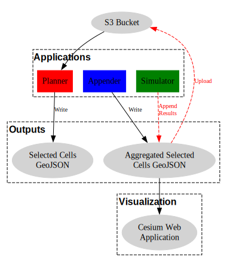

# Snow Observing Strategy (SOS)

This repository contains the codebase for SOS applications integrated within the [Novel Observing Strategies Testbed (NOS-T)](https://github.com/code-lab-org/nost-tools).

## NOS-T Installation

### Install the NOS-T Library

Clone the GitHub repo:

```bash
git clone git@github.com:emmanuelgonz/nost-tools.git
```

If the above command fails, you are not authenticated into Git correctly. In this case, try cloning using HTTPS:

```bash
git clone https://github.com/emmanuelgonz/nost-tools.git
```

> Note: The above links will clone a forked version of the NOS-T Tools library.

Change directory:

```bash
cd nost-tools
```

Create Conda environment:

```bash
conda create --name nost python=3.11
```

Activate Conda environment:

```bash
conda activate nost
```

Install NOS-T with dependencies for our SOS applications:

```bash
python3 -m pip install .[examples]
```

### Credentials

Credentials required by NOS-T can be defined in your bashrc file or using a .env file.

#### Bashrc

Open your bashrc file:

```bash
vim ~/.bashrc
```

Add the following lines:

```bash
export USERNAME=<NOS-T Keycloak Username>
export PASSWORD=<NOS-T Keycloak Password>
export CLIENT_ID=<Ask NOS-T Operator>
export CLIENT_SECRET_KEY=<Ask NOS-T Operator>
```

Source the changes:

```bash
source ~/.bashrc
```

#### .env

You can create a .env file using the same values as listed above:

```bash
vim .env
```

Add the following lines:

```bash
USERNAME=<NOS-T Keycloak Username>
PASSWORD=<NOS-T Keycloak Password>
CLIENT_ID=<Ask NOS-T Operator>
CLIENT_SECRET_KEY=<Ask NOS-T Operator>
```

> NOTE: Restart your computer after defining environmental variables in your ~/.bashrc file.

### AWS CLI

The applications use the Amazon Web Services (AWS) command line interface (CLI).

#### Install AWS CLI

Installation instructions are provided below. For further information on AWS CLI installation, [click here](https://docs.aws.amazon.com/cli/latest/userguide/getting-started-install.html).

##### Linux

```bash
curl "https://awscli.amazonaws.com/awscli-exe-linux-x86_64.zip" -o "awscliv2.zip"
unzip awscliv2.zip
sudo ./aws/install
```

##### Windows

1. Download and run the AWSL CLI installer: 

```powershell
msiexec.exe /i https://awscli.amazonaws.com/AWSCLIV2.msi
```

2. Confirm successful installation

```powershell
aws --version
```

##### Mac

1. Download AWS CLI installer:

```bash
curl "https://awscli.amazonaws.com/AWSCLIV2.pkg" -o "AWSCLIV2.pkg"
```

2. Run the installer: 

```bash
sudo installer -pkg ./AWSCLIV2.pkg -target /
```

3. Confirm successful installation:

```bash
aws --version
```

#### Configure AWS CLI

Once installed, the AWS CLI must be configured:

```bash
aws configure
```

Enter the Access Key ID and Secret Access Key provided by the NOS-T operator.

## Introduction

A single manager application is responsible for orchestrating the various applications and keeping a consistent time across applications. Upon initiation of the manager, various managed applications are triggered, each responsible for generating derived, merged datasets or raster layers sent as base64-encoded strings. Below is a table describing each application:

|Application|Purpose|Data Source|Developed|Containerized|
|:---------:|:-----:|:---------:|:-------:|:-----------:|
|Manager|Orchestrates applications, maintains time|NA|Y|Y|
|Planner|Selects best taskable observations on the basis of reward|LIS|Y|N|
|Appender|Aggregates planned taskable observations, filtering duplicates|Planner|Y|N|
|Simulator|Simulates satellite operations and determines when and where observations are collected|Appender|Y|N|


Applications communicate via a RabbitMQ message broker utilizing the Advanced Message Queuing Protocol (AMQP) protocol. The figure below illustrates the overall workflow:

<p align="center">
  
  <br>
  <em>Snow Observing Systems (SOS) application workflow.</em>
</p>


The input data and output data generated by applications are uploaded onto an Amazon Web Services (AWS) Simple Storage Service (S3) bucket with the following data structure:

```bash
snow_observing_systems/
└── daily
    ├── 2019-03-01
    │   ├── Appender
    │   ├── Planner
    │   └── Simulator
    ├── 2019-03-02
    │   ├── Appender
    │   ├── Planner
    │   └── Simulator
    ├── 2019-03-03
    │   ├── Appender
    │   ├── Planner
    │   └── Simulator
    ├── 2019-03-04
    │   ├── Appender
    │   ├── Planner
    │   └── Simulator
    ├── 2019-03-05
    │   ├── Appender
    │   ├── Planner
    │   └── Simulator
    ├── 2019-03-06
    │   ├── Appender
    │   ├── Planner
    │   └── Simulator
    ├── 2019-03-07
    │   ├── Appender
    │   ├── Planner
    │   └── Simulator
    ├── 2019-03-08
    │   ├── Appender
    │   ├── Planner
    │   └── Simulator
    ├── 2019-03-09
    │   ├── Appender
    │   ├── Planner
    │   └── Simulator
    └── 2019-03-10
        ├── Appender
        ├── Planner
        └── Simulator
```

The applications use the AWS SDK for Python, [Boto3](https://boto3.amazonaws.com/v1/documentation/api/latest/index.html). Boto3 allows users to create, configure, and manage AWS services, including S3, Simple Notification Service (SNS), and Elastic Compute Cloud (EC2). Access to the AWS SDK is limited to SOS administrators as required by NASA's [Science Managed Cloud Environment (SMCE)](https://smce.nasa.gov/). 


<details> 
<summary></summary>
custom_mark10
    digraph MQTT_PubSub {
        subgraph cluster0 {
            style=dashed;
            label="AWS";
            fontsize=12;
            fontname="Helvetica-Bold";
            s3 [label="S3 Bucket", shape=rect, style=filled, fillcolor=red, fontsize=16];
            lambda [label="Lambda", shape=rect, style=filled, fillcolor=green, fontsize=16];
        }
        s3 -> lambda [label="Data", fontsize=12, fontcolor=black, color=black, style=dashed];
        subgraph cluster1 {
            style=dashed;
            label="NOS-T System";
            fontsize=16;
            fontname="Helvetica-Bold";
            nost_apps [label="NOS-T Apps"];
        }
        lambda -> nost_apps []
    }
custom_mark10
</details>

## Installation

Applications can be deployed using a Conda environment. Please note that this method requires advanced experience working with GDAL, as it's installation can be quite tricky. If you run into issues here, please follow the [Docker](#docker-development) or [Docker compose](#docker-compose) sections.

To set up conda, follow the steps below:

1. Create a Conda environment using Python 3.10

    ```bash
    conda create --name sos python=3.10
    ```

1. Activate your Conda environment

    ```bash
    conda activate sos
    ```

1. Install dependencies for GDAL

    ```bash
    sudo add-apt-repository ppa:ubuntugis/ppa && sudo apt-get update
    sudo apt-get update
    sudo apt-get install gdal-bin
    sudo apt-get install libgdal-dev
    export CPLUS_INCLUDE_PATH=/usr/include/gdal
    export C_INCLUDE_PATH=/usr/include/gdal
    ```

1. Install requirements

    ```bash
    python3 -m pip install -r requirements.txt
    ```

    > NOTE: If this final step fails, it is likely due to the incorrect GDAL version being listed in the [requirements.txt](./requirements.txt) file. To correct this, identify the correct GDAL version for your system:

### Troubleshooting

```bash
gdalinfo --version
```

Your output should look similar to:
```bash
GDAL 3.6.4, released 2023/04/17
```

Finally, install the correct GDAL version by running:
```bash
python3 -m pip install GDAL==<insert version number>
```

For example,

```bash
python3 -m pip install GDAL==3.6.4
```

## Execution

### Docker (Development)

Each container can be built individually during development, to build a local version of a container, you can use ```docker build```. 

For example, to build the "manager" comntainer:

```
cd src/manager/
docker build -t sos_manager .
docker run --rm --env-file .env -v "$(pwd)/data":/opt/data sos_manager
```

> NOTE: You can follow similar steps to build the other containers, such as satellites, layer_resolution, layer_snow_cover, etc.

### Docker Compose
Three applications, including manager, satellite, and snow cover layer applications, can be run using Docker compose. To run applications, do the following:

1. Download input data, which should be in the following structure:

    ```
    data/
    ├── Downloaded_files
    │   ├── Mo_basin_shp
    │   │   ├── WBD_10_HU2_Shape
    │   │   └── WBD_10_HU2_Shape.zip
    │   ├── Resolution_raw
    │   │   └── SNODAS
    │   └── Snow_cover_raw
    │       ├── hdf
    │       └── nc
    ├── Efficiency_files
    │   ├── Efficiency_high_resolution_Caesium
    │   │   ├── efficiency_resolution.nc
    │   │   ├── efficiency_resolution_taskable.nc
    │   │   ├── efficiency_snow_cover.nc
    │   │   └── efficiency_snow_cover_up.nc
    │   └── Efficiency_resolution20_Optimization
    │       ├── Efficiency_SWE_Change_dataset_Capella.nc
    │       ├── Efficiency_Sensor_dataset.nc
    │       ├── Efficiency_Sensor_dataset_Capella.nc
    │       ├── Efficiency_Sensor_dataset_GCOM.nc
    │       ├── Efficiency_Temperature_dataset.nc
    │       ├── Efficiency_Temperature_dataset_coarsened.nc
    │       ├── Optimization_result.geojson
    │       ├── Temperature_dataset.nc
    │       ├── coarsened_eta_output_Capella.nc
    │       ├── coarsened_eta_output_GCOM.nc
    │       ├── efficiency_resolution_layer.nc
    │       ├── efficiency_snow_cover.nc
    │       ├── eta0_resampled_to_match_coarsened_grid.nc
    │       ├── final_blocks_rewards.geojson
    │       ├── final_eta_combined_output_Capella.nc
    │       └── final_eta_combined_output_GCOM.nc
    └── Preprocessed_files
        ├── preprocessed_resolution.nc
        └── preprocessed_snow_cover.nc
    ```

1. Confirm you have a .env file in your working directory with the following contents:

    ```
    # FILE/DIR PATHS 
    path_hdf=data/Downloaded_files/Snow_cover_raw/hdf
    path_nc=data/Downloaded_files/Snow_cover_raw/nc/
    path_shp=data/Downloaded_files/Mo_basin_shp/
    path_preprocessed=data/Preprocessed_files/
    path_efficiency=data/Efficiency_files/Efficiency_high_resolution_Caesium/
    raw_path=data/Downloaded_files/Resolution_raw/

    # EARTHACCESS LOGIN
    EARTHDATA_USERNAME=<Your EarthAccess username>
    EARTHDATA_PASSWORD=<Your EarthAccess password>

    # NOS-T LOGIN
    HOST=<Contact NOS-T admins>
    KEYCLOAK_PORT=8443
    KEYCLOAK_REALM=<Contact NOS-T admins>
    RABBITMQ_PORT=5671
    USERNAME=<Your Keycloak username in NOS-T ecosystem>
    PASSWORD=<Your Keycloak password in NOS-T ecosystem>
    CLIENT_ID=<Contact NOS-T admins>
    CLIENT_SECRET_KEY=<Contact NOS-T admins>
    VIRTUAL_HOST="/"
    IS_TLS=True

    # CESIUM LOGIN
    TOKEN=<Cesium access token>
    ```

1. Orchestrate the containers:

    ```
    docker-compose up -d
    ```

    > NOTE: To confirm Docker containers are running, run the command: ```docker ps```. You should see three containers list: sos_manager, sos_satellites, and sos_snow_cover_layer.

1. To shutdown the Docker containers:

    ```
    docker-compose down
    ```